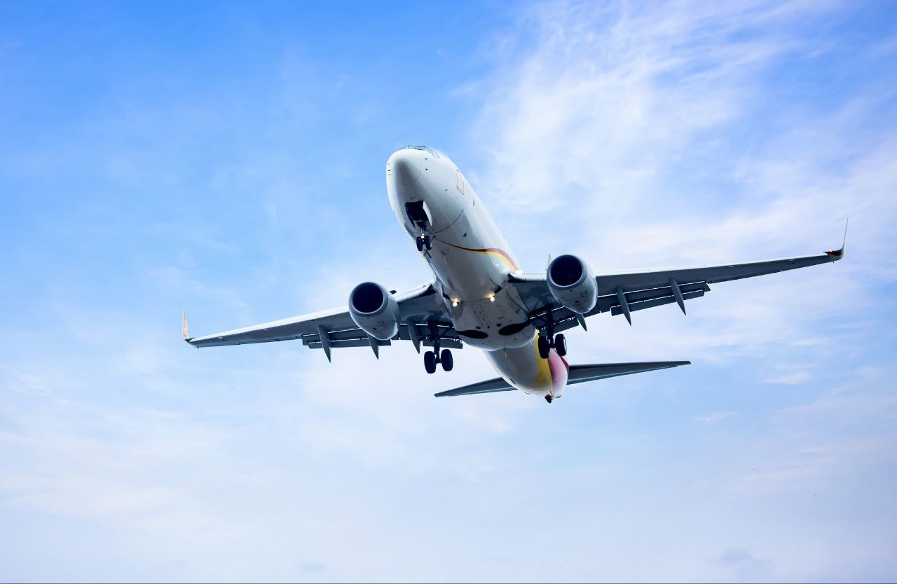
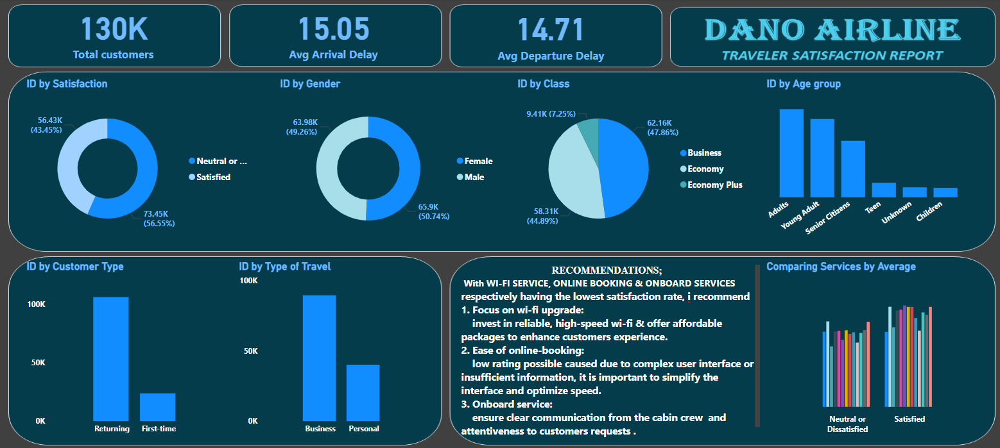

# Airline Satisfaction Report


# Data Source
Capstone project at **Digitaley Drive**.

# Introduction
In the highly competitive aviation industry, customer satisfaction is a critical determinant of success, as it influences brand loyalty and overall business performance. This Power BI project focuses on analyzing key insights into how travelers feel about their experiences with *Dano Airline*. With a significant drop in the satisfaction rate to below 50%, the project aims to uncover the factors contributing to this decline and provide actionable recommendations to enhance customer experience. Through data visualization and advanced analytics, this project seeks to deliver a comprehensive understanding of customer sentiment, trends, and improvement opportunities, ensuring Dano Airline can regain its reputation and exceed customer expectations.

# Problem Statement
*Task is to recommend a data-driven strategy for increasing **Dano Airline** satisfaction rate, and present it in the form of a single page report or dashboard.*

# Concept Execution
The following Power Bi features were incoperated;

- Data cleaning,
- Power Query,
- Data modeling,
- Caculated Columns and Measures using Dax,
- Data Visualization,
- Filters,
- Dashboard Building and
- Reporting.

# Data Cleaning
In this analysis, null and empty rows in the fact column were replaced with zero (0), a new column was created to separate age group of customers (Children, Teen, Young Adult, Adults and Senior Citizen) using this Dax formula,
```Age group = SWITCH(TRUE(), airline_passenger_satisfaction[Age] >= 7 && airline_passenger_satisfaction[Age] <= 12, "Children", airline_passenger_satisfaction[Age] >= 13 && airline_passenger_satisfaction[Age]<= 19, "Teen", airline_passenger_satisfaction[Age]>= 20 && airline_passenger_satisfaction[Age]<=35, "Young Adult", airline_passenger_satisfaction[Age]>=36 && airline_passenger_satisfaction[Age]<=50, "Adults", airline_passenger_satisfaction[Age] >=51 && airline_passenger_satisfaction[Age]<=65, "Senior Citizens", "Unknown")```

# Data Discovery

1. *Total Customers & Delays* :
130K total customers were surveyed, Average arrival delay is 15.05 minutes, and average departure delay is 14.71 minutes.

2. *Satisfaction* :
56.55% of travelers reported being satisfied, 43.45% were neutral or dissatisfied, suggesting room for improvement.

3. *Gender Distribution*:
Almost an equal split between male (50.7%) and female (49.2%) customers.

4. *Class* :
Majority of travelers fly in Economy Class (44.89%), followed by Business (47.82%), and a small segment in Economy Plus (7.25%).

5. *Age Groups* :
Largest customer base is Adults (45K), followed by Young Adults (40K) and Senior Citizens (29K),Teens, Children, and Unknown categories form a very small proportion.

6. *Customer Type* :
Returning customers dominate the customer base, indicating loyalty, First-time flyers make up a smaller portion, representing opportunities for growth in customer acquisition.

7. *Type of Travel* :
Majority of flights are business-related, Leisure travel forms a smaller portion, suggesting Dano Airlines may primarily serve corporate clients.

# Visualiosation



**Key Insights from Services (Based on Average Values)**:

1. *In-flight Wi-Fi Service*:
Likely one of the most significant contributors to dissatisfaction. Poor performance, limited availability, or high costs could be issues driving negative feedback.

2. *Food and Drinks*:
ratings indicate dissatisfaction which could be a result of poor quality, portion sizes, or availability.

3. *In-flight Entertainment*:
This could point to limited content, outdated systems, or technical issues. Younger and more tech-savvy passengers may expect better systems.

4. *Onboard Service*:
A lower rating here implies inconsistent staff attentiveness or delays in responding to customer requests, directly affecting satisfaction.

5. *Gate Location and Boarding Process*:
passengers may be facing logistical challenges, such as inconvenient gate changes or disorganized boarding.

6. *Ease of online booking*:
it may stem from issues concerning * complex user interface causing confusion to navigate the site and lack of sufficient information about the flight.
Limited payment options or frequent transaction failures might discourage user

# Recommendation

1. *Focus on Wi-Fi Upgrades*:
Invest in reliable, high-speed Wi-Fi and offer affordable packages to enhance customer experience.

2. *Enhance Seating Comfort*:
Redesign Economy-class seats to improve legroom, padding, and recline features for long flights.

3. *Revamp Food Offerings*:
Provide a wider selection of meals and beverages, catering to diverse dietary needs, and improve the presentation and quality of meals.

4. *Modernize Entertainment*:
Update in-flight systems with a broader range of movies, shows, and games. Consider integrating streaming options compatible with personal devices.

5. *Service Optimization*:
Train cabin crew to proactively address passenger needs and ensure prompt service delivery throughout the flight.

6. *Streamline Boarding*:
Organize boarding and ensure clear communication to reduce confusion and improve the passenger experience.

7. *Online booking service*:
personalise user experience and simplify site interface for ease navigation and expand payment options for convenience and cost transparency.

Improving these areas could significantly boost overall passenger satisfaction.


